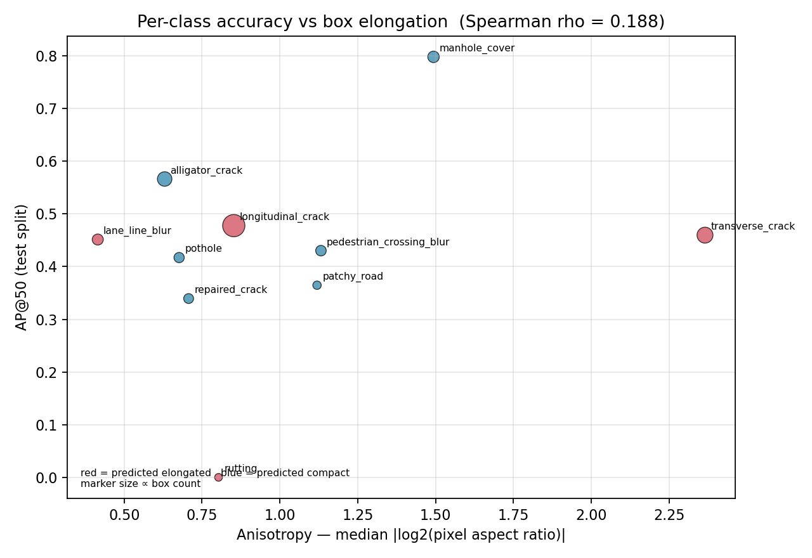

# E1 — Anisotropy analysis

Tests whether per-class detection accuracy falls as boxes get more elongated.
Gates experiment E4 in `ml/research/RESEARCH_PROGRAM.md`.

## Sources

- **labels**: `/tmp/staged2/test/labels`
- **images**: `/tmp/staged2/test/images`
- **per_class_ap**: `runs/research/20260803_131409_E0-baseline_s1337/per_class_ap.json`

## Per-class geometry

| Class | Boxes | Anisotropy | Median AR | AR p10–p90 | Median area | % boxes <1% area |
|---|---:|---:|---:|---:|---:|---:|
| transverse_crack | 1,495 | 2.365 | 5.15 | 2.76–9.67 | 1.025% | 48.7% |
| manhole_cover | 555 | 1.494 | 2.82 | 1.48–4.35 | 0.314% | 81.4% |
| pedestrian_crossing_blur | 399 | 1.132 | 0.83 | 0.37–4.75 | 1.352% | 41.9% |
| patchy_road | 85 | 1.119 | 2.17 | 1.07–4.33 | 1.928% | 35.3% |
| longitudinal_crack | 3,356 | 0.852 | 0.58 | 0.24–1.30 | 1.063% | 48.6% |
| rutting | 3 | 0.803 | 0.57 | 0.55–0.83 | 25.203% | 0.0% |
| repaired_crack | 292 | 0.707 | 1.37 | 0.58–2.55 | 0.517% | 61.6% |
| pothole | 353 | 0.676 | 1.57 | 0.91–2.59 | 0.425% | 76.2% |
| alligator_crack | 1,156 | 0.630 | 1.38 | 0.69–2.75 | 7.699% | 7.6% |
| lane_line_blur | 482 | 0.415 | 1.04 | 0.61–2.24 | 3.843% | 21.4% |

*Anisotropy = median |log2(pixel aspect ratio)|. 0 is square; 1.0 means the typical box is 2:1 or 1:2. Aspect ratios are in PIXELS, not normalised YOLO units — see `scan_boxes()` for why that distinction matters.*

## Hypothesis test

- Classes matched: **10**
- Spearman rho (AP vs anisotropy): **0.188** (permutation p = 0.6068, 100,000 permutations)
- Spearman rho (AP vs box area): -0.248 (p = 0.4909)
- Spearman rho (anisotropy vs area): -0.394

### Pre-registered prediction

- Predicted-elongated classes, median anisotropy: **0.827**
- Predicted-compact classes, median anisotropy: **0.676**
- Prediction holds: **True**

## Verdict

DOES NOT SUPPORT the hypothesis. The elongation story is wrong or is not the dominant factor. Per RESEARCH_PROGRAM.md section 3 E1, the program should pivot to E2/E3/E5 as its main line rather than running E4. This is a real finding - report it, do not bury it.

## Figure

